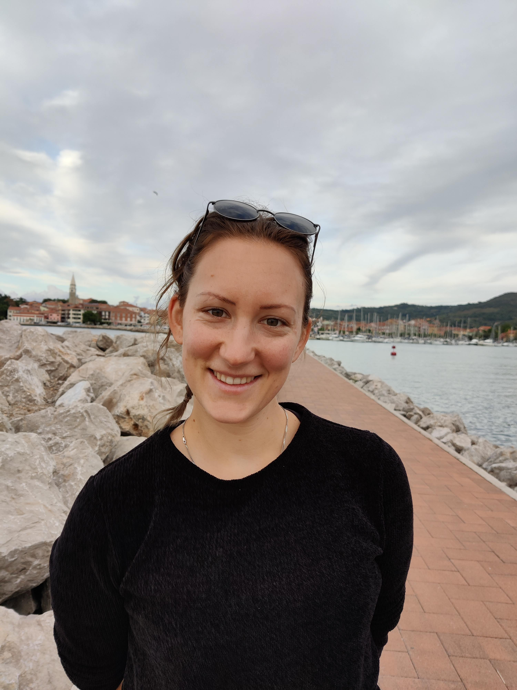

First year PhD student in the Algorithms and Complexity research group at Durham University ([ACiD](http://community.dur.ac.uk/algorithms.complexity/)).

## Research interests:

- Graph Theory and Algorithms
- Parametrized Complexity

## Education

- `2020 - 2024`
__Durham University__
PhD at __Durham University__ under the supervison of [George B. Mertzios](http://community.dur.ac.uk/george.mertzios/) and [Matthew Johnson](https://community.dur.ac.uk/matthew.johnson2/)

- `2015 - 2020`
__FAMNIT, University of Primorska__
BsC and MsC in Mathematics
